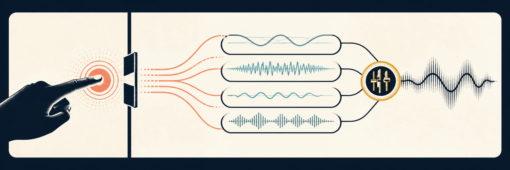

# Browser audio that starts on purpose

`@jbdevprimary/gesture-audio` provides the small, composable infrastructure
behind dependable interactive audio. It starts Web Audio only after a real
gesture, routes continuous Tone.js signals through a caller-named bus graph,
plays Howler sprites, and applies persisted preferences without owning an
application's cue naming or storage model.

The central guarantee is intentionally narrow: a successful start means both
`Tone.start()` and the application's bootstrap completed. If either fails, the
next gesture can retry rather than leaving the application in a half-ready
state.

## What it provides

- A typed Tone.js bus graph with a master limiter, independent mute layers,
  and timed ducking.
- A Howler sprite resolver that validates maps and keeps active loops in sync
  with live mix changes.
- A bridge from a small asynchronous preferences store to both engines.
- Node-only sprite verification from the separate `build-tools` entry point.

## What stays in your application

Cue names, gameplay policy, persistence implementation, and product-specific
audio decisions are deliberately local. Start with the [quick start](./quick-start.md)
or read the [architecture](./architecture.md) before integrating the library.
